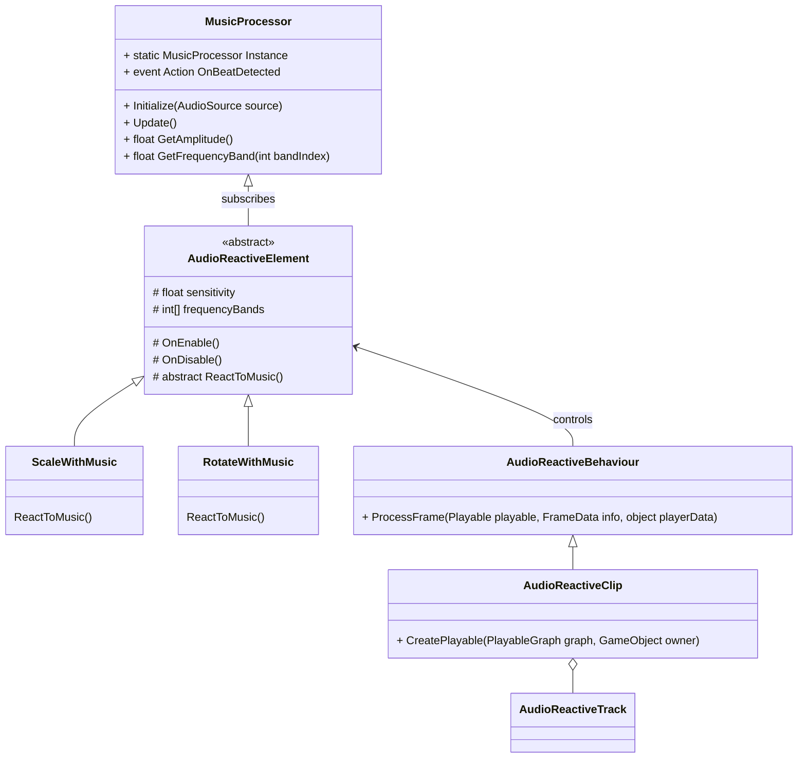

# Modular Music Visualization System for Unity

---

## Introduction

This document provides a comprehensive overview of a modular music visualization system for Unity. The system is designed to facilitate the creation of visual elements that react to music, leveraging Unity's Timeline package for seamless integration and ease of use. The design emphasizes extensibility, modularity, and integration with standard Unity workflows.

---

## Revised System Design

### Overview

- **Goal:** Create a Unity package that enables developers to build music-reactive visualizations easily.
- **Key Features:**
  - **Single Audio Processing Class:** A centralized class handles all music processing.
  - **Extendible Visual Elements:** Visual elements are modular and can be easily extended.
  - **Integration with Unity Timeline:** Visual elements can be drag-and-dropped into the Unity Timeline for time-based control.
  - **Independent Song Communication:** Visual elements receive real-time data from the audio processing class.

### Key Components

1. **Audio Processing Module**
   - `MusicProcessor.cs`
   - Handles all aspects of music analysis and data broadcasting.

2. **Visual Elements**
   - Base class: `AudioReactiveElement.cs`
   - Derived classes implement specific behaviors (e.g., scaling, rotation).
   - Designed for extensibility.

3. **Timeline Integration**
   - Custom tracks and clips that integrate with Unity's Timeline.
   - Allows visual elements to be controlled over time.

4. **Data Communication**
   - Visual elements subscribe to the `MusicProcessor` for real-time data.
   - Utilizes events and delegates for efficient communication.

5. **Extensibility and Modularity**
   - Use of interfaces and abstract classes.
   - Encourages the creation of new visual behaviors without modifying core code.

---

## Detailed Components

### 1. Audio Processing Module

#### **MusicProcessor.cs**

**Class:** `MusicProcessor` (Singleton)

- **Responsibilities:**
  - Processes audio data from a provided audio source.
  - Extracts frequency bands, amplitude, and beat information.
  - Provides real-time data to visual elements.

**Key Methods:**

- `Initialize(AudioSource source)`
  - Sets up the audio source for processing.

- `Update()`
  - Called every frame to update audio data.

- `float GetAmplitude()`
  - Returns the current amplitude of the audio.

- `float GetFrequencyBand(int bandIndex)`
  - Returns the value of a specific frequency band.

- `event Action OnBeatDetected`
  - Event triggered when a beat is detected.

- `static MusicProcessor Instance`
  - Provides a global access point to the `MusicProcessor`.

### 2. Visual Elements

#### **AudioReactiveElement.cs**

**Abstract Class:** `AudioReactiveElement` (Inherits from `MonoBehaviour`)

- **Responsibilities:**
  - Serves as the base class for all audio-reactive visual elements.
  - Defines the standard interface and methods for reacting to music data.

**Key Methods:**

- `protected virtual void OnEnable()`
  - Subscribes to `MusicProcessor` events.

- `protected virtual void OnDisable()`
  - Unsubscribes from `MusicProcessor` events.

- `protected abstract void ReactToMusic()`
  - Abstract method to implement custom reactions.

**Properties:**

- `public float sensitivity`
  - Adjusts the responsiveness of the element.

- `public int[] frequencyBands`
  - Specifies which frequency bands to react to.

#### **Example Derived Classes**

##### **ScaleWithMusic.cs**

**Class:** `ScaleWithMusic` (Inherits from `AudioReactiveElement`)

- **Responsibilities:**
  - Scales the GameObject based on music data.

- **Overrides:**

  - `protected override void ReactToMusic()`
    - Implements scaling logic using frequency data.

##### **RotateWithMusic.cs**

**Class:** `RotateWithMusic` (Inherits from `AudioReactiveElement`)

- **Responsibilities:**
  - Rotates the GameObject based on music data.

- **Overrides:**

  - `protected override void ReactToMusic()`
    - Implements rotation logic using frequency data.

### 3. Timeline Integration

#### **AudioReactiveTrack.cs**

**Class:** `AudioReactiveTrack` (Inherits from `TrackAsset`)

- **Responsibilities:**
  - Integrates visual elements with Unity's Timeline.
  - Manages `AudioReactiveClip` instances.

#### **AudioReactiveClip.cs**

**Class:** `AudioReactiveClip` (Inherits from `PlayableAsset`)

- **Responsibilities:**
  - Represents a clip on the Timeline controlling a visual element.

- **Key Methods:**

  - `public override Playable CreatePlayable(PlayableGraph graph, GameObject owner)`
    - Creates the playable behavior for the clip.

#### **AudioReactiveBehaviour.cs**

**Class:** `AudioReactiveBehaviour` (Inherits from `PlayableBehaviour`)

- **Responsibilities:**
  - Defines how the visual element behaves during the clip's duration.

- **Key Methods:**

  - `public override void ProcessFrame(Playable playable, FrameData info, object playerData)`
    - Updates the visual element each frame based on Timeline data.

### 4. Data Communication

- Visual elements subscribe to the `MusicProcessor` to receive real-time music data.
- Communication is handled via events and delegates for efficiency.
- Ensures that all visual elements react in sync with the music.

### 5. Extensibility and Modularity

- **Interfaces and Abstract Classes:**
  - Use of `AudioReactiveElement` as an abstract base class.
  - Developers can create new visual elements by inheriting and implementing `ReactToMusic()`.

- **Ease of Integration:**
  - Visual elements are standard `MonoBehaviour` scripts.
  - Can be attached to any GameObject.

- **Timeline Integration:**
  - Custom tracks and clips allow for time-based control without modifying the core system.

---

## Class and File Structure

### **Scripts Folder**

- **MusicProcessor.cs**
  - Contains the `MusicProcessor` class.

- **AudioReactiveElement.cs**
  - Base class for all audio-reactive elements.

- **Derived Visual Elements**
  - **ScaleWithMusic.cs**
  - **RotateWithMusic.cs**
  - **CustomVisualElement.cs** (Template for creating new elements)

### **Timeline Folder**

- **AudioReactiveTrack.cs**
  - Custom track for the Timeline.

- **AudioReactiveClip.cs**
  - Custom clip for the Timeline.

- **AudioReactiveBehaviour.cs**
  - Defines behavior during Timeline playback.

### **Editor Folder**

- **AudioReactiveTrackEditor.cs**
  - Custom editor for the Timeline track.

- **AudioReactiveClipEditor.cs**
  - Custom editor for the Timeline clip.

---

## Mermaid Diagram



---

## Conclusion

This revised system design ensures:

- **Extensibility:** Developers can easily create new visual elements by extending `AudioReactiveElement`.
- **Integration with Unity Timeline:** Visual elements can be controlled over time using Unity's built-in Timeline, avoiding the need to create a custom GUI timeline.
- **Centralized Music Processing:** A single `MusicProcessor` class handles all audio analysis, providing data to all visual elements.
- **Modularity:** Components are decoupled, promoting reusability and ease of maintenance.

---

# Next Steps

- **Implement the `MusicProcessor` class, ensuring efficient audio analysis and data broadcasting.**
- **Develop a set of basic visual elements (e.g., scaling, rotation) as examples.**
- **Integrate the visual elements with Unity's Timeline using custom tracks and clips.**
- **Provide documentation and templates to encourage developers to create their own visual elements.**

---

# Additional Considerations

- **Performance Optimization:**
  - Profile the `MusicProcessor` to ensure it does not become a bottleneck.
  - Consider using multi-threading if necessary.

- **User Experience:**
  - Create custom editor scripts to enhance usability.
  - Provide clear instructions and tooltips within the Unity Editor.

- **Compatibility:**
  - Test the package across different Unity versions.
  - Ensure it works on various platforms (PC, mobile, VR).

---

# Documentation

A comprehensive documentation file (`Documentation.md`) should accompany the package, including:

- **Getting Started Guide:**
  - How to set up the `MusicProcessor`.
  - How to use existing visual elements.

- **Creating Custom Visual Elements:**
  - Step-by-step guide on extending `AudioReactiveElement`.

- **Timeline Integration:**
  - Instructions on adding visual elements to the Timeline.
  - Explanation of custom tracks and clips.

- **API Reference:**
  - Detailed descriptions of classes, methods, and properties.

---

# Mermaid Diagram File

The Mermaid diagram provided above visually represents the system's class relationships and can be included in the documentation for clarity.

---

This design provides a solid foundation for a modular, extensible music visualization system in Unity, aligning with the project's goals and ensuring ease of use for developers.

# File Structure

Here’s the suggested file structure under `Assets/Nebula/` based on the design:

```
Assets/
└── Nebula/
    ├── Audio/
    │   ├── MusicProcessor.cs
    │   ├── PreprocessedData.cs
    │   ├── AudioPreprocessor.cs
    ├── Core/
    │   ├── AudioReactiveElement.cs
    │   ├── VisualElements/
    │   │   ├── ScaleWithMusic.cs
    │   │   ├── RotateWithMusic.cs
    │   │   ├── CustomVisualElementTemplate.cs
    ├── Timeline/
    │   ├── AudioReactiveTrack.cs
    │   ├── AudioReactiveClip.cs
    │   ├── AudioReactiveBehaviour.cs
    ├── Editor/
    │   ├── AudioReactiveTrackEditor.cs
    │   ├── AudioReactiveClipEditor.cs
    ├── Examples/
    │   ├── ExampleScene.unity
    │   ├── ExampleMaterials/
    │   │   ├── ReactiveMaterial.mat
    │   ├── ExampleScripts/
    │   │   ├── ExampleCustomVisual.cs
    ├── Resources/
    │   ├── PreprocessedAudioData.asset
    ├── Documentation/
    │   ├── README.md
    │   ├── LICENSE.md
```

### Explanation of Folders

1. **Audio:**
   - Contains the core music processing classes like `MusicProcessor.cs`, `PreprocessedData.cs`, and the `AudioPreprocessor.cs` script that helps pre-analyze the audio data.

2. **Core:**
   - Holds the core visual element scripts, including the base class `AudioReactiveElement.cs` and specific behaviors such as `ScaleWithMusic.cs` and `RotateWithMusic.cs`. 
   - The `VisualElements/` subfolder is a place for various custom visual behaviors you can develop or extend.

3. **Timeline:**
   - Contains the integration scripts for Unity’s Timeline package. Includes the custom `AudioReactiveTrack.cs`, `AudioReactiveClip.cs`, and `AudioReactiveBehaviour.cs`.

4. **Editor:**
   - Contains custom editor scripts to enhance the Unity Editor experience, such as `AudioReactiveTrackEditor.cs` and `AudioReactiveClipEditor.cs` to manage the Timeline visual elements.

5. **Examples:**
   - Holds an example scene (`ExampleScene.unity`) demonstrating the system in action.
   - Contains example materials (`ReactiveMaterial.mat`) and custom visual scripts (`ExampleCustomVisual.cs`).

6. **Resources:**
   - Stores any preprocessed audio data (`PreprocessedAudioData.asset`) or other necessary assets accessible at runtime.

7. **Documentation:**
   - Includes the `README.md` for project documentation and `LICENSE.md` for licensing information.

---