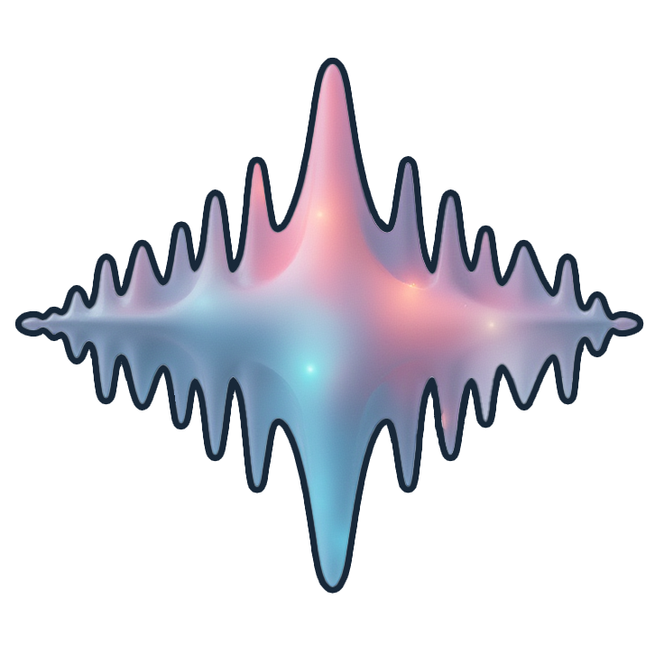

<p align="center">
  
</p>

# Nebula

**Nebula** is a modular, extendable Unity package designed to create dynamic, music-reactive visualizations. Leveraging Unity's powerful Timeline system and an intuitive audio processing architecture, Nebula allows developers to build custom visual elements that react to audio in real-time or through preprocessed data.

## Features

- **Music Visualization**: React to different aspects of music such as frequency bands, amplitude, and beats.
- **Modular Architecture**: Create and add custom visual behaviors easily by extending base classes.
- **Unity Timeline Integration**: Control visual elements over time via Unity's Timeline tool.
- **Live & Preprocessed Audio Processing**: Switch between real-time audio analysis and preprocessed audio data for optimized performance.
- **Beat Detection**: Built-in support for detecting beats in the music and reacting accordingly.

## Getting Started

### Requirements

- Unity 2021.1 or newer
- Basic understanding of Unity’s Timeline system and C# scripting

### Installation

1. Clone or download the **Nebula** repository.
2. Import the package into your Unity project:
   - Go to `Assets -> Import Package -> Custom Package` and select the Nebula `.unitypackage`.
   - Or, drag and drop the `Nebula` folder into your Unity `Assets` directory.

### Usage

#### Setting up Nebula in your Scene

1. **Add the MusicProcessor:**
   - In your scene, create an empty GameObject named `NebulaProcessor`.
   - Attach the `MusicProcessor` component to the GameObject.
   - Assign an `AudioSource` with your music clip to the `MusicProcessor`.
   
2. **Choose Processing Mode:**
   - Select between `Live` and `Preprocessed` modes in the `MusicProcessor` inspector.
   
3. **Add Visual Elements:**
   - Create or select any GameObject you want to react to music.
   - Attach any of the included audio-reactive components like `ScaleWithMusic`, `RotateWithMusic`, or create your own by extending the `AudioReactiveElement` base class.
   
4. **Control via Timeline (Optional):**
   - Add visual elements to the Unity Timeline for time-based control.
   - Drag and drop `AudioReactiveClip` to the Timeline and adjust parameters over time.

#### Extending Nebula

To create your own visual elements:

1. Create a new script that inherits from `AudioReactiveElement`.
2. Override the `ReactToMusic()` method to define how your GameObject will respond to audio data.
3. Attach your custom script to any GameObject.

```csharp
public class CustomVisualElement : AudioReactiveElement
{
    protected override void ReactToMusic()
    {
        // Example: Change the color based on amplitude
        float amplitude = MusicProcessor.Instance.GetAmplitude();
        GetComponent<Renderer>().material.color = new Color(amplitude, 0f, 0f);
    }
}
```

### Preprocessing Audio Data

1. Use the provided `AudioPreprocessor` utility to analyze and store audio data before runtime.
2. Load the preprocessed data into the `MusicProcessor` for optimized performance during playback.

## Example Scene

An example scene is included in the `Nebula/Examples/` folder. Open the scene to see how the **MusicProcessor**, visual elements, and Timeline interact together.

## Roadmap

- Add more sample visual behaviors like color changes, particle effects, etc.
- Improve the preprocessing pipeline with more efficient FFT algorithms.
- Add support for more complex beat detection algorithms.
- Expand the library with more ready-made visual components.

## Contributions

Feel free to contribute to **Nebula** by creating issues or submitting pull requests. For major changes, please open an issue to discuss what you'd like to change.

## License

This project is licensed under the MIT License. See the `LICENSE.md` file for details.

## Contact

For any questions or feedback, please reach out to @ehsuun.